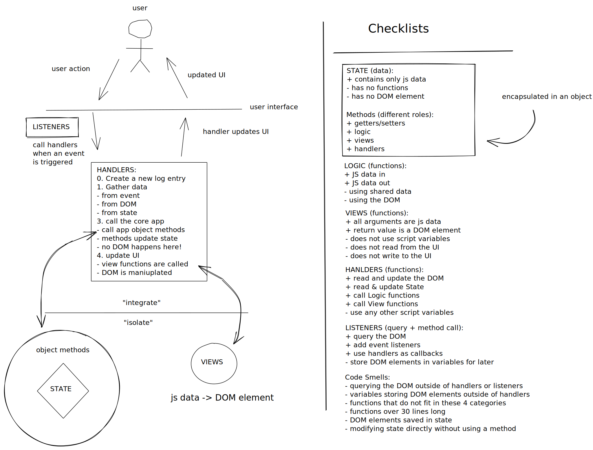

# Encapsulation

> "Encapsulation is one of the fundamentals of OOP (object-oriented programming). It refers to the bundling of data with the methods that operate on that data. "
>
> - [Rebus](https://press.rebus.community/programmingfundamentals/chapter/encapsulation/)

_Encapsulation_ is the idea of grouping together your data with the functions that use it. That's it! (for now :) There are many ways to achieve this, but the end result is code that is easier to understand and nicer work with.

Heads up! In this module you'll be encountering some of the most important (and most challenging!) aspects of the JavaScript language `this`, inheritance & classes. These are all features of JS that allow you to encapsulate functions & data for readable, reusable code.

Along the way you will get your first introduction to one of the main programming paradigms in JS: _object oriented_. At their simplest level, programming paradigms are just different answers to the same question "How will I group my data and my functions?".

## Contents

- [Getting Started](#getting-started)
- [Learning Objectives](#learning-objectives)
- [About the Projects](#about-the-projects)
- [Suggested Study](#suggested-study)
- Sundays & Projects
  - [Week 1](#week-1)
  - [Week 2](#week-2)
  - [Week 3](#week-3)
- [Class Recordings](#class-recordings)
- [HYF Home](https://home.hackyourfuture.be/) (external)
- [Study Book](https://hackyourfuture.github.io/study/) (external)

---

## Getting Started

How to study the code in this repo.

<details>
<summary>expand/collapse</summary>
<br>

> You will need [NPM](https://docs.npmjs.com/downloading-and-installing-node-js-and-npm) and [nvm](https://github.com/nvm-sh/nvm#installing-and-updating) on your computer to study this material
>
> Using a browser with good DevTools will make your life easier: [Chromium](http://www.chromium.org/getting-involved/download-chromium), [FireFox](https://www.mozilla.org/en-US/firefox/new/), [Edge](https://www.microsoft.com/edge), [Chrome](https://www.google.com/chrome/)

1. Install or update the `study-lenses` package globally
   - `npm install -g study-lenses` (if you do not have it already)
   - `npm update -g study-lenses` (if you already have it installed)
1. Clone this repository:
   - `git clone git@github.com:HackYourFutureBelgium/encapsulation.git` (SSH) (recommended)
   - `git clone https://github.com/HackYourFutureBelgium/encapsulation.git` (HTTPS)
   - `gh repo clone HackYourFutureBelgium/encapsulation` (GH CLI)
1. `cd` into the repository
   - `cd state`
1. Run the `study` command from your CLI
   - `study`
1. The material will open in your default browser, you're good to go!

> If you have a windows computer and get this error:
>
> - `... /study.ps1 cannot be loaded because running scripts ...`
>
> follow the instructions in [this StackOverflow answer](https://stackoverflow.com/a/63424744), that should take care of it ; )

</details>
<br>

[TOP](#encapsulation)

---

## Learning Objectives

<details>
<summary>open/close</summary>

### Vocabulary

- **Encapsulation**
- **Object Oriented Programming**
- **Inheritance**
- **Code Reuse (DRY)**

* Data-first development
  - Understanding applications as Data + User Interactions
  - Developing from the "inside" out: Writing the core object before the user interface
* Organizing your projects into _modules_
* Object Oriented TDD
  - Using tests to define and verify OOP programs

### Hard Skills

- Use the keyword `this`
  - Be able to refactor functions into methods
  - Be able to refactor methods into functions
  - Plan and implement objects based on User Stories
- Use `getters` and `setters`
  - Be able to refactor between properties, methods and getters/setters
- Using `import` & `export` to organize your codebase
- Understand _prototypical inheritance_
- Use ES6 `Class`es to organize your code
  - Be able to refactor between constructor functions & classes
  - Use classes to create simple programs
- `bind`ing handlers to `this`
- `function () {}` vs. `() => {}`
  - How does each one treat `this` differently?
- Closure 101:
  - Using `() => {}` handlers to avoid binding

</details>

[TOP](#encapsulation)

---

## About the Projects

Projects in this module will have all the same concerns as projects in the last module, they'll just be organized a little differently. In the last module every function was a free-floating function written in a separate file and required separately into your .html files.

In this module you'll learn how to:

- _Encapsulate_ your application's data with the functions that operate on it using _object oriented programming_.
- Reuse your methods with _inheritance_ and ES6 `class`es

<details>
<summary>project diagram</summary>
<br/>



</details>
<br/>

[TOP](#encapsulation)

---

## Suggested Study

links to help with this module.

<details>
<summary>open/close</summary>
<br>

### Helpful Links

- [Practical JavaScript Tutorial](https://watchandcode.com/p/practical-javascript) (best tutorial ever)
- [study.hyf.be/js/oop](https://study.hackyourfuture.be/javascript/oop) (more links)
- Getters & Setters
  - [Mosh](https://programmingwithmosh.com/javascript/javascript-properties-getters-and-setters/)
  - [Zell](https://dev.to/zellwk/why-use-getters-and-setters-functions-5a5f)
- [Playlist -'Complicated' elements of Javascript on simple examples (RUS + English subs)](https://www.youtube.com/playlist?list=PLqKQF2ojwm3l4oPjsB9chrJmlhZ-zOzWT)

### Binding

- [Examples of `this` and bind](https://www.youtube.com/watch?v=PIkA60I0dKU)
- FunFunFunction
  - [this & bind pt. 1](https://www.youtube.com/watch?v=GhbhD1HR5vk&list=PL0zVEGEvSaeHBZFy6Q8731rcwk0Gtuxub)
  - [this & bind pt. 2](https://www.youtube.com/watch?v=PIkA60I0dKU&list=PL0zVEGEvSaeHBZFy6Q8731rcwk0Gtuxub&index=2)
- Zach Gordon: [this](https://www.youtube.com/watch?v=2qMKjWf1KdE), [binding this](https://www.youtube.com/watch?v=73aAyap_88w), [example: event handlers](https://www.youtube.com/watch?v=sxRnmKldiBs)
- [Binding example in JS Tutor](http://www.pythontutor.com/javascript.html#code=function%20returnThis%28%29%20%7B%0A%20%20return%20this%3B%0A%7D%0Aconst%20demo0%20%3D%20returnThis%28%29%3B%0A%0Aconst%20obj1%20%3D%20%7B%0A%20%20id%3A%201,%0A%20%20returnThis%0A%7D%3B%0Aconst%20demo1%20%3D%20obj1.returnThis%28%29%3B%0A%0Aconst%20obj2%20%3D%20%7B%20id%3A%202%20%7D%3B%0Aconst%20boundToObj2%20%3D%20returnThis.bind%28obj2%29%3B%0Aconst%20demo2%20%3D%20boundToObj2%28%29%3B%0A%0Aconst%20boundToLiteral%20%3D%20returnThis.bind%28%7B%20id%3A%203%20%7D%29%3B%0Aconst%20demo3%20%3D%20boundToLiteral%28%29%3B&curInstr=0&mode=display&origin=opt-frontend.js&py=js&rawInputLstJSON=%5B%5D)
- [`() => {}` vs. `function() {}`](https://www.freecodecamp.org/news/when-and-why-you-should-use-es6-arrow-functions-and-when-you-shouldnt-3d851d7f0b26/)

### Prototypes & Delegation

- [Common Misconceptions](https://medium.com/javascript-scene/common-misconceptions-about-inheritance-in-javascript-d5d9bab29b0a)

### ES6 Modules

- articles
  - [javascript.info/modules-intro](https://javascript.info/modules-intro)
  - [javascript.info/import-export](https://javascript.info/import-export)
  - [javascripttutorial.net](https://www.javascripttutorial.net/es6/es6-modules/)
- videos
  - [Web Dev Simplified](https://www.youtube.com/watch?v=cRHQNNcYf6s)
  - [The Codeholic](https://www.youtube.com/watch?v=ananPWEdfDA)
  - [Meth Meth Method](https://www.youtube.com/watch?v=aWah7hLrSa8)
  - [HYF class recording](https://vimeo.com/412299042)

### Exercises

- [Isolate](./isolate/index.html)
- [Integrate](./integrate/README.md)

### Code to Study

- [Example Projects](./example-projects/README.md)

### OOP TDD

- [numbery-organizer](https://github.com/hackyourfuturebelgium/numbery-organizer)
- [Bowling](https://github.com/codicepulito/tdd-js-tutorial-bowling)
- Iron Hack: [Maze (constructor)](https://github.com/ironhack-labs/lab-javascript-maze), [Vikings (classes)](https://github.com/ironhack-labs/lab-javascript-vikings)
- Rolling Scopes: [TicTacToe](https://github.com/rolling-scopes-school/tic-tac-toe), [Finite State Machine](https://github.com/rolling-scopes-school/finite-state-machine)
- [Kata for Fun (not only OOP)](https://github.com/edsonha/kata-for-fun)

</details>
<br>

[TOP](#encapsulation)

---

## Week 1

Learn to use `function () {}` functions and `this` to encapsulate your data, logic and views.

<details>
<summary>open/close</summary>
<br>

### Before Class

- [Mosh explains `this`](https://www.youtube.com/watch?v=gvicrj31JOM)
- [Traversy OOP Crashcourse](https://www.youtube.com/watch?v=vDJpGenyHaA) (first 10 minutes)
- [javascript.info/object-methods](https://javascript.info/object-methods)
- [StackOverflow](https://stackoverflow.com/questions/17486854/how-to-create-a-method-in-object-literal-notation)
- [() => {} vs. function() {}](https://www.freecodecamp.org/news/when-and-why-you-should-use-es6-arrow-functions-and-when-you-shouldnt-3d851d7f0b26/)
- Isolate:
  - Functions to Methods (examples)

### During Class

#### Before Break

- Isolate
  - Functions to Methods
  - Getters & Setters

#### After Break

- ./refactors/cycler (example)
  1. 2-encapsulated
- Integrate (exercise)
  - 01-app-objects/exercises/average

### After Class

No project this week.

Spend your time getting familiar with `this` and following the [Practical JavaScript Tutorial](https://watchandcode.com/p/practical-javascript) (best tutorial ever). It will be a great review of what we've covered at HYF. Take a moment to appreciate how much you've learned!

Looking for a little challenge? Try refactoring the tutorial's final code into this [Practical JavaScript starter repo](https://github.com/HackYourFutureBelgium/practical-javascript-refactor-starter)

</details>
<br>

[TOP](#encapsulation)

---

## Week 2

Learn to:

- inspect prototype chains in the debugger
- tell the difference between _static_ and _instance_ methods
- use `Object.create` for code reuse

<details>
<summary>open/close</summary>
<br>

### Before Class

- Prototype Delegation
  - [Just JavaScript](https://github.com/HackYourFutureBelgium/just-javascript/tree/master/09-prototypes)
  - [prototype chain diagram](./diagrams/prototype-chain-1.jpeg)
  - [more detailed diagram](./diagrams/prototype-chain-2.jpeg)
  - [javascript.info](https://javascript.info/prototype-inheritance)
- `Object.create()`
  - FunFunFunction: [Prototypes in JavaScript](https://www.youtube.com/watch?v=riDVvXZ_Kb4), [Prototype Basics](https://www.youtube.com/watch?v=YkoelSTUy7A&list=PL0zVEGEvSaeHBZFy6Q8731rcwk0Gtuxub&index=3),[`Object.create()`](https://www.youtube.com/watch?v=CDFN1VatiJA)
  - [Griffith](https://www.youtube.com/watch?v=qqyZn8X9M3I)
  - [WebTunings](https://www.youtube.com/watch?v=4MUgn3XeOZM)
  - [MDN](https://developer.mozilla.org/en-US/docs/Web/JavaScript/Reference/Global_Objects/Object/create)
- Code to Study:
  - [Cycler Refactor](./example-projects/refactors/cycler) through `5-create-many.html`

### During Class

#### Before Break

- Isolate: 7. Prototype Delegation

#### After Break

- Isolate: 8. `Object.create`
- Integrate: 3. `Object.create`

### After Class

> group or individual, your choice

List Manager! Following up on the tutorial from last week, you will build a web page that allows users to create as many lists as they want, each with a different title. You will need to refactor the todo list from WatchAndCode into a prototype object that can be used to create new list instances with `Object.create`. There is a [starter repository](https://github.com/HackYourFutureBelgium/starter-encapsulation-list-prototype) with the basics to get you started. Enjoy!

#### Checklist

Individual Checklist:

```md
- [ ] [repo](https://github.com/_/_) with a complete README
- [ ] [live demo](https://_.github.io/_)
- [ ] [project-planning](_https://github.com/_/_/tree/master/project-planning)
```

Group Checklist:

```md
- [ ] [repo](https://github.com/_/_) with a complete README
- [ ] [live demo](https://_.github.io/_)
- [ ] [planning](_https://github.com/_/_/tree/master/planning)
- [ ] [A project board](https://github.com/_/_/projects/X)
- [ ] [One issue per task](https://github.com/_/_/issues) (with labels and milestones)
- [ ] [One branch per issue](https://github.com/_/_/network)
- [ ] [One reviewed PR per completed issue](https://github.com/_/__/pulls?q=is%3Apr+is%3Aclosed)
```

</details>
<br>

[TOP](#encapsulation)

---

## Week 3

Learn to use `Class`es for a reusable code base.

<details>
<summary>open/close</summary>
<br>

### Before Class

- Classes
  - [Traversy](https://www.youtube.com/watch?v=RBLIm5LMrmc)
  - [javascript.info](https://javascript.info/class)
  - [Beau](https://www.youtube.com/watch?v=bq_jZY6Skto)
  - [MDN](https://developer.mozilla.org/en-US/docs/Web/JavaScript/Reference/Classes)

### During Class

#### Before Break

- [isolate](./isolate/index.html)
  - 9. Classes

#### After Break

- [integrate](./integrate/index.html)
  - 5. Classes

### After Class

Impress yourselves!

Using [this starter repository](https://github.com/hackyourfuturebelgium/classes-starter), plan and scope a project of your choosing. This can be a totally new idea or a refactor of a previous project, just keep it small ;)

#### Checklist

```md
- [ ] [repo](https://github.com/_/_) with a complete README
- [ ] [live demo](https://_.github.io/_)
- [ ] [planning](_https://github.com/_/_/tree/master/planning)
- [ ] [A project board](https://github.com/_/_/projects/X)
- [ ] [One issue per task](https://github.com/_/_/issues) (with labels and milestones)
- [ ] [One branch per issue](https://github.com/_/_/network)
- [ ] [One reviewed PR per completed issue](https://github.com/_/__/pulls?q=is%3Apr+is%3Aclosed)
```

</details>
<br>

[TOP](#encapsulation)

---

## Class Recordings

Coaches, when sending your PR's with links please ...

- Indicate which class you were teaching
- Which week it was
- Give your name
- and a helpful description

---

### Class 7 & 8

> [Anthony](https://github.com/Toinne/), [Bram](https://github.com/bramdevries/)

1. week 1:
   - Part 1: [`this`](https://vimeo.com/399611933)
   - Part 2: [Object Oriented Programming](https://vimeo.com/399631422)
2. week 2:
   - Part 1: [binding, and why it matters](https://vimeo.com/401830596)
   - Part 2: [binding handlers](https://vimeo.com/401853625)

### [Class-9-10](https://hackyourfuturebelgium.github.io/class-9-10)

> [Anthony](https://github.com/Toinne/), [Unmesh](https://github.com/unmeshvrije/), [Nawang](https://github.com/nawatend)

1. Week 1:
   - Part 1: [`this`](https://vimeo.com/453294595)
   - Part 2: [OOP Refactor](https://vimeo.com/453294872)
2. Week 2:
   - Part 1: [getting/setting & Prototypes](https://vimeo.com/455538183)
   - Part 2: [`Object.create` pt. 1](https://vimeo.com/455538415), [pt. 2](https://vimeo.com/455538951)
3. Week 3:
   - Part 1: [Isolating Classes](https://vimeo.com/457832595)
   - Part 2: [Integrating Classes](https://vimeo.com/457832956)

### [Class-11-12](https://github.com/hackyourfuturebelgium/class-11-12)

> [Yash](https://github.com/yash-kapila), [Unmesh](https://github.com/unmeshvrije/), [Thibault](https://github.com/ThibaultLesuisse)

1. Week 1:
   - Part 1: [`this` & object methods](https://vimeo.com/499602299)
   - Part 2: [more `this` & separated vs. encapsulated](https://vimeo.com/499602628)
1. Week 2:
   - Part 1: [Prototypes](https://vimeo.com/501759856)
   - Part 2: [More prototypes](https://vimeo.com/501760204)
1. Week 3:
   - Part 1: [Classes](https://vimeo.com/504396242)
   - Part 1: [Classes](https://vimeo.com/504395219)
